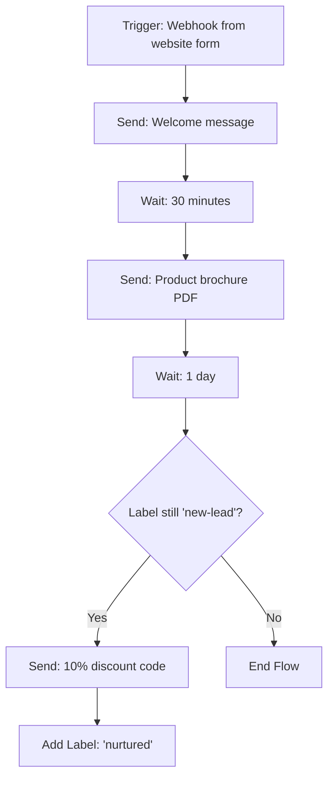

# Automation

:::warning Current V4 availability
The V4 **Automation** page is currently marked **Coming Soon**. You cannot create or manage V4 automations from this page yet.

Continue operating existing automations in **V3** until the V4 automation engine is released. The V4 page previews planned webhook triggers, label triggers, scheduled follow-ups, response logs, and workflow actions, but those controls are not currently available for configuration.
:::

The remainder of this page describes the planned/legacy automation model. Do not treat its setup steps as an available V4 workflow until Wabot removes the Coming Soon state.

## Where to Find It

Sidebar → **CORE → Automation** — `https://app.wabot.io/dashboard/automation`


## Before You Build an Automation

1. Connect the WhatsApp account that will own the workflow.
2. Create any labels, templates, Broadcast Lists, Google Sheets connection, or webhook endpoint that the flow will use.
3. Decide whether the same person may trigger the flow more than once.
4. Write down a controlled test case before enabling the automation.

## The Automation Dashboard

When you open Automation, you see stats and a list of all your flows:

- **Total Automations** (e.g. `2 / 50 used`)
- **Active** — how many are currently enabled
- **Total Executions** — lifetime run count
- **Contacts Processed**

Filters: **All Status**, **All Triggers**.

The table columns:

- **Automation Name**
- **Trigger** (Label / Webhook)
- **Stats** (runs, actions)
- **Created** date
- **Status** (Active / Inactive)
- **Actions** (edit, duplicate, delete)

---

## Creating an Automation

Click **Create Automation** to go to `/dashboard/automation/new`. The setup form has three sections:


### 1. Basic Information

- **Automation Name \*** — e.g. "Welcome New Lead"
- **Description** — internal notes
- **Account Type**:
  - **Unofficial API**
  - **Official API**
- **WhatsApp Account \*** — pick from the dropdown
- **Status** — Enable or disable

### 2. Trigger Type

Choose one:

import Tabs from '@theme/Tabs';
import TabItem from '@theme/TabItem';

<Tabs>
<TabItem value="webhook" label="Webhook" default>

**Use case:** Triggered by external webhook calls from forms, CRM, e-commerce platforms, custom apps.

- The webhook URL is generated **after** you create the automation
- You can then paste it into Google Forms, Stripe, Typeform, Formidable, etc.
- External systems `POST` data to this URL to trigger a new run

</TabItem>
<TabItem value="label" label="Label">

**Use case:** Triggered when a label is added or removed from a contact on WhatsApp.

- Pick a label name (e.g. `new-lead`, `vip`)
- Choose trigger direction: **on add**, **on remove**, or both
- Every time that label changes on a contact, the automation fires

</TabItem>
</Tabs>

### 3. Advanced Settings

- **Run Once Per Contact** — prevents re-running if the same contact re-triggers
- **Error Handling:**
  - **Skip action with errors** (continue to next action)
  - **Stop automation on error**

For a label trigger, select the label and either **Label Added** or **Label Removed**. Click **Create & Add Actions** to open the flow builder.

---

## Adding Actions

After creation, you build the flow by adding actions one by one. Common action types:

| Action | What it does |
|--------|--------------|
| **Send Message** | Text, image, video, PDF, voice note |
| **Wait** | Delay X minutes / hours / days |
| **Add Label** | Tag the contact |
| **Remove Label** | Untag the contact |
| **Add to Group** | Add contact to an audience group |
| **Remove from Group** | Remove contact from a group |
| **Update Google Sheet** | Append a row or update existing |
| **Call Webhook** | HTTP POST to an external URL |
| **Condition (If/Else)** | Branch based on contact data |
| **End Flow** | Terminate the automation early |
| **Schedule Follow-Up** | Create a later follow-up for the person |
| **Cancel Follow-Up** | Cancel pending follow-ups for the person |
| **Send Official Template** | Send an approved Official API template |

Arrange actions in sequence. Each action passes context (contact info, trigger payload) to the next.

### Configure and Test the Flow

1. Add the first action after the trigger.
2. Fill its fields and insert variables from the trigger payload or contact data.
3. Add delays, conditions, and follow-up actions in their intended order.
4. Save the flow.
5. Trigger it with your own test contact or a test webhook payload.
6. Open the automation's **Logs** and **Follow-ups** areas to confirm every step completed as expected.
7. Enable the automation only after the test outcome is correct.

:::tip
The trigger type is fixed after creation. If you need to change from a webhook trigger to a label trigger, clone or create a new automation rather than assuming the existing trigger can be changed.
:::

---

## Example — Lead Nurturing Flow



### Build it in Wabot:

1. Create automation with **Webhook** trigger, name it "Lead Nurturing".
2. Copy the generated webhook URL.
3. In your website form or Zapier, configure a POST to that URL on submit.
4. Add actions:
   - Send Message: "Hi \{name\}, thanks for your interest!"
   - Wait: 30 minutes
   - Send Message (with PDF attachment): "Here's our product brochure."
   - Wait: 1 day
   - Condition: If label = `new-lead`
     - True → Send Message: "Here's 10% off: SAVE10"
     - False → End Flow
   - Add Label: `nurtured`
5. Enable the automation.

---

## Triggering from Anywhere (Webhook)

Once created, the webhook URL looks like:

```
https://app.wabot.io/api/automation/webhook/YOUR_UNIQUE_ID
```

Call it from:

- **A button on your website** (via JavaScript fetch)
- **Zapier / Make / Pabbly** actions
- **A cron job** or scheduled task
- **Stripe webhooks** on payment events
- **Google Forms** via Apps Script
- **Any custom app** that can POST JSON

### Example payload:

```json
{
  "phone": "60123456789",
  "name": "Ahmad",
  "email": "ahmad@example.com",
  "order_id": "1234"
}
```

All fields become available as placeholders in your Send Message actions: `{name}`, `{email}`, `{order_id}`, etc.

---

## Monitoring Runs

Click an automation to see the **Settings**, **Actions**, **Logs**, and **Follow-ups** tabs:

- **Logs** — executions, errors, filters, and journey view
- **Follow-ups** — scheduled work created by the automation
- **Retry** or **Retry Failed** — available for failed log entries after you correct the cause
- **Live Preview** and **Preview Message** — review the configuration before enabling it

Use this to debug flows and ensure nothing fires silently.

:::warning
An automation cannot be enabled without a connected WhatsApp account. Website accounts are not supported for automation creation, updates, or enabling.
:::

## Maintain an Automation

From the automation list, you can search and filter by status or trigger. Use the row actions to:

- **Enable / Disable** an automation without deleting its setup.
- **Edit** its settings and actions.
- **Clone** a working flow before adapting it to a new campaign.
- **Delete** obsolete flows after checking their pending logs and follow-ups.

Use a unique, descriptive name and keep a disabled test version of important production workflows.

---

## Best Practices

- Keep flows small and focused — one outcome per automation
- Use **Run Once Per Contact** to prevent spam on re-triggers
- Always add an **error-handling** path
- Test with your own number before enabling
- Use **labels** as checkpoints to prevent duplicate nurturing
- Monitor the **Total Executions** and **Contacts Processed** on the list page

---

**See also:** [Webhooks & API](/docs/integrations/webhooks) · [Chatbots](./chatbots) · [Broadcast](./broadcast)
