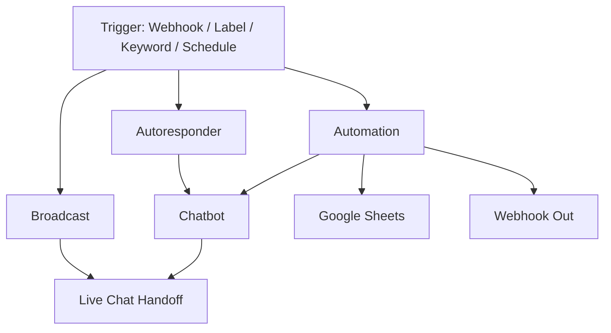

# Core Features

Wabot bundles six core capabilities into one unified dashboard. Active features integrate across workspaces, for example routing from an Autoresponder to Live Chat or broadcasting to segments created in Audience Hub. V4 Automation integration is not available yet.

## The Six Core Features

- **[Chatbots](/docs/features/chatbots)** — AI-powered bots that answer FAQs, qualify leads, and close sales 24/7.
- **[Broadcast](/docs/features/broadcast)** — Send bulk campaigns to contact groups or segments with scheduling.
- **[Automation](/docs/features/automation)** — Currently Coming Soon in V4. Continue existing automation workflows in V3 until the V4 engine is released.
- **[Autoresponder](/docs/features/autoresponder)** — Keyword-based auto-replies for greetings, FAQs, and quick support.
- **[Live Chat](/docs/features/live-chat)** — Shared team inbox with filters: All, Unread, Widget, Chatbot Active/Inactive, Archived.
- **[Templates](/docs/features/templates)** — Reusable message components: pre-approved, lists, buttons, polls, sequences, quick replies.

## Choosing the Right Feature

| I want to... | Use this feature |
|--------------|------------------|
| Send a promotion to 500 contacts | **Broadcast** |
| Reply automatically to "harga" keyword | **Autoresponder** |
| Use AI to answer pricing questions | **Chatbots** |
| Trigger a message when a form is submitted | **Automation in V3** (V4 Coming Soon) |
| Follow up when a WhatsApp label changes | **Automation in V3** (V4 Coming Soon) |
| Let my team reply to customers together | **Live Chat** |
| Reuse pre-approved WABA message templates | **Templates → Pre-Approved** |
| Save canned responses for quick replies | **Templates → Quick Replies** |
| Send an interactive list of options | **Templates → Lists** |
| Send a button menu | **Templates → Buttons** |

---

## How Features Connect

## Supporting Workspaces

The core features are supported by:

- **[Audience Hub](/docs/contacts/audience)** — people, subscribers, follow-ups, lists, labels, and groups
- **[File Manager](/docs/tools/file-manager)** — campaign media and chatbot knowledge files
- **[REST API & OAuth](/docs/tools/rest-api)** — programmatic integrations and OAuth/MCP clients
- **[Account Settings](/docs/tools/settings)** — profile, preferences, security, owner settings, and activity
- **[Account Error Logs](/docs/tools/account-error-logs)** — owner troubleshooting for chatbot, broadcast, API, RAG, widget, and system failures

Click any feature in the sidebar to dive deeper.
