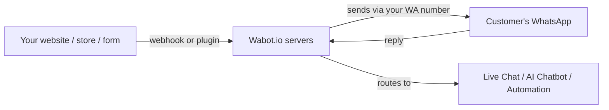

# Getting Started — Overview

Welcome to Wabot! This section walks you through everything you need to get your account up and running in under 15 minutes.

## What is Wabot?

Wabot.io is an all-in-one WhatsApp automation platform that lets you:

- Send transactional notifications (orders, bookings, payments)
- Broadcast marketing messages to contact lists
- Deploy AI chatbots that handle FAQs and close sales
- Build no-code automations triggered by webhooks or WhatsApp labels
- Manage conversations from a shared team inbox
- Set up keyword-based autoresponders

It connects to your WhatsApp via a **QR code scan** (like WhatsApp Web) or the **Official WhatsApp Business API** (WABA) for larger businesses. You can also deploy a web widget from a connected account's chatbot settings.

---

## How Wabot Works

1. A trigger happens — new order, form submission, scheduled broadcast, keyword received.
2. Wabot receives the event via plugin, webhook, API, or its own scheduler.
3. Wabot composes and sends the WhatsApp message through your linked number.
4. Replies come back into Wabot's Live Chat, AI chatbot, or automation engine.

---

## Connection Methods

When you **Add Account** in Wabot, you can currently choose one of two working integration methods:

import Tabs from '@theme/Tabs';
import TabItem from '@theme/TabItem';

<Tabs>
<TabItem value="unofficial" label="Unofficial API (Popular)" default>

**Best for:** Personal numbers, small to medium businesses.

- Connect by scanning a QR code or pairing code
- Quick setup — instant connection
- Free to use
- Standard WhatsApp features with flexible messaging
- No pre-approved templates needed

</TabItem>
<TabItem value="official" label="Official API">

**Best for:** Large enterprises with verified WhatsApp Business accounts.

- Uses the official Meta WhatsApp Business API (WABA)
- Requires an access token from Meta
- Advanced features and high message limits
- Official Meta support
- Requires pre-approved message templates

</TabItem>
<TabItem value="webchat" label="WebChat (Coming soon)">

The Add Account page displays a WebChat card for website-only AI chatbots and widgets, but it is currently disabled and marked **Coming soon**.

To use a web widget today, first connect an Unofficial or Official API account. Then open **Chatbots → [account] → Widget Setting** to configure and deploy it.

</TabItem>
</Tabs>

---

## Ready to Start?

Follow these steps in order:

1. **[Sign Up & Login](./signup)**
2. **[Dashboard Tour](./dashboard)**
3. **[Connect Your WhatsApp Account](./connect-account)**
4. **[Send Your First Message](./first-message)**

Once done, explore the [Core Features](/docs/features/) section.
